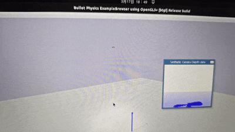
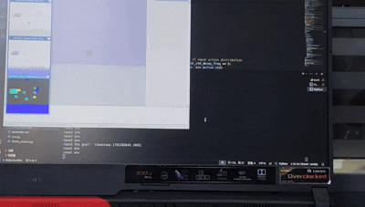

# Deep-Vision-Based-Drone-Navigation-Based-on-Reinforcement-Learning
This is an extension based on the gym-pybullet-drones environment, using kinematic information and RGBD camera details for drone navigation reinforcement learning training.

      

## Installation
Tested on Intel x86_64/Ubuntu 22.04 

```sh
git clone https://github.com/NOOBHZ233/Deep-Vision-Based-Drone-Navigation-Based-on-Reinforcement-Learning.git
cd  Deep-Vision-Based-Drone-Navigation-Based-on-Reinforcement-Learning/

conda create -n drone python=3.9
conda activate drone

pip3 install -e . 

```

## Try it 
# train
cd Deep-Vision-Based-Drone-Navigation-Based-on-Reinforcement-Learning/examples
python3 learn.py 

## Author
Chengwei Zhang
2017809834@qq.com

## References
@INPROCEEDINGS{panerati2021learning,
      title={Learning to Fly---a Gym Environment with PyBullet Physics for Reinforcement Learning of Multi-agent Quadcopter Control}, 
      author={Jacopo Panerati and Hehui Zheng and SiQi Zhou and James Xu and Amanda Prorok and Angela P. Schoellig},
      booktitle={2021 IEEE/RSJ International Conference on Intelligent Robots and Systems (IROS)},
      year={2021},
      volume={},
      number={},
      pages={7512-7519},
      doi={10.1109/IROS51168.2021.9635857}
}
